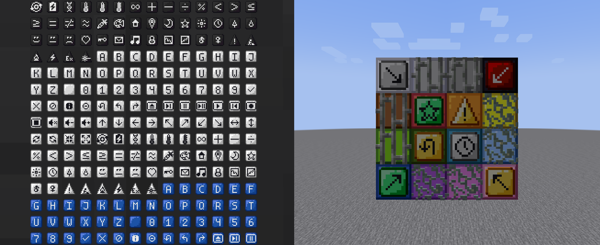

# Factory Symbols
Collection of meaningful symbol items for Minecraft Java Edition and ways to display them.

 

## Introduction:
Factory Symbols is a Minecraft mod for NeoForge and Fabric that adds a collection of symbol items to the game.  
These symbols are designed to be meaningful and can be used for labeling purposes, like making Create's Redstone Link frequencies more recognizable.  
They are regular items that are cheaply craftable and transmutable and have uniform and recognizable textures.

 

## Installation:
You can visit the [releases page](https://github.com/the-drunken-cod/FactorySymbols/releases), the [Modrinth page](https://modrinth.com/mod/factory-symbols), or the [CurseForge page](https://www.curseforge.com/minecraft/mc-mods/factory-symbols) to download the latest version of Factory Symbols.  
Then simply place the downloaded JAR file into your Minecraft `mods` folder and launch the game with either NeoForge or Fabric.  
For multiplayer, ensure the mod is installed on the server and all clients connecting to it. [Automodpack](https://modrinth.com/mod/automodpack) can make this process easier.
  
> [!IMPORTANT]  
> The **Fabric version** requires [Cloth Config API](https://modrinth.com/mod/cloth-config) to be installed as well.

> [!NOTE]  
> You will need either the [NeoForge](https://neoforge.dev/) or [Fabric](https://fabricmc.net/) mod loader installed to run the mod.  
> An easy way of doing this is by creating a modded game instance in a launcher like [ATLauncher](https://atlauncher.com/) or [MultiMC.](https://multimc.org/)

 

## Development Notes:
- This mod is still in early development, so expect major changes and breaking updates until the v1.0.0 release.
- Developer docs can be found in the [`dev_docs.md` file.](./dev_docs.md)
- DataGen JSONs (in `neoforge/src/generated` and `fabric/src/generated`) will be excluded from the repo until the v1.0.0 release. If you still want access to those files, you can either unzip the released JAR file, or set up the Java dev env and run the `./gradlew :neoforge:runData` or `./gradlew :fabric:runData` command.

 

## Compatibility:
- **Sable / Create Aeronautics:**
  - Block weight support

 

## Attribution:
- Created with [jaredlll08/MultiLoader-Template](https://github.com/jaredlll08/MultiLoader-Template)
- Sound effects:
  - [`ratchet.wav` by caseymoura](https://freesound.org/s/445492/) - License: Attribution 3.0
  - [`ratchet socket wrench tool` by AlaskaRobotics](https://freesound.org/s/551497/) - License: Creative Commons 0
  - [`Tools Ratchet.wav` by CapsLok](https://freesound.org/s/181634/) - License: Creative Commons 0
- Inspired by the [virtual circuit network symbols](https://wiki.factorio.com/Circuit_network#Virtual_signals) from the game [Factorio](https://www.factorio.com/)

 

## Modpack Policy
You are free to use Factory Symbols in any modpacks; public or private :)  
Just make sure you abide by [our licenses](#licenses), common sense, and [the Minecraft EULA.](https://minecraft.net/en-us/eula)  
We would also appreciate a mention in the credits section of your modpack and a quick shout on our [discussion board](https://github.com/the-drunken-cod/FactorySymbols/discussions) about your modpack (so we can check it out and play it ourselves!)  
Please also consider [reporting any issues or suggestions](https://github.com/the-drunken-cod/FactorySymbols/issues), so we can improve the mod for you and other players and have better compatibility with other mods.

 

## Licenses
Code is licensed under the [AGPL-3.0-only.](./LICENSE.txt)  
Original resources and assets in `common/src/main/resources/` are licensed under [MIT](src/main/resources/LICENSE.txt) unless otherwise stated.

 

## Disclaimers:
NOT AN OFFICIAL MINECRAFT PRODUCT. NOT APPROVED BY OR ASSOCIATED WITH MOJANG OR MICROSOFT.  
  
THE SOFTWARE IS PROVIDED "AS IS", WITHOUT WARRANTY OF ANY KIND, EXPRESS OR IMPLIED, INCLUDING BUT NOT LIMITED TO THE WARRANTIES OF MERCHANTABILITY, FITNESS FOR A PARTICULAR PURPOSE AND NONINFRINGEMENT. IN NO EVENT SHALL THE AUTHORS OR COPYRIGHT HOLDERS BE LIABLE FOR ANY CLAIM, DAMAGES OR OTHER LIABILITY, WHETHER IN AN ACTION OF CONTRACT, TORT OR OTHERWISE, ARISING FROM, OUT OF OR IN CONNECTION WITH THE SOFTWARE OR THE USE OR OTHER DEALINGS IN THE SOFTWARE.
