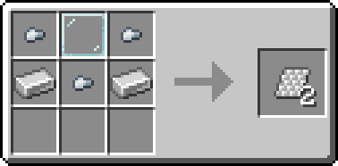
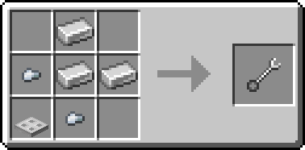
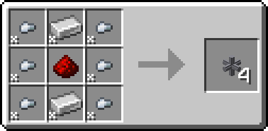
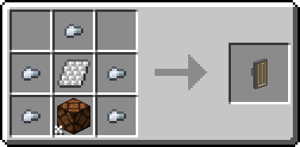
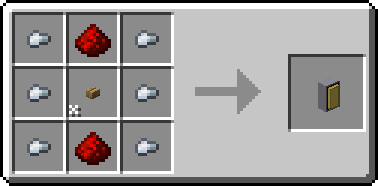
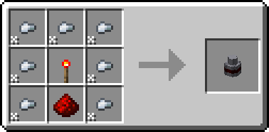
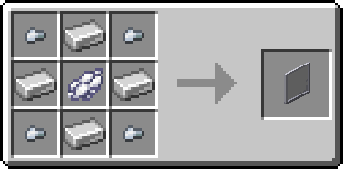
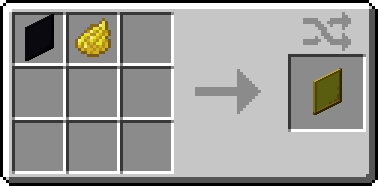

# Symbols'n'Signs Documentation
## Table of Contents

- [Items](#items)
  - [Symbols](#symbols) - Generic symbols, emoticons, arrows and more, in 6 material variants.
  - [Signs](#signs) - More specific items for labeling and decoration, made from retroreflective sheets.
  - [Retroreflective Sheet](#retroreflective-sheet) - Material used for crafting signs.
  - [Ratchet Wrench](#ratchet-wrench) - Tool for configuring and picking up Sign Posts and Fixtures.
- [Blocks](#blocks)
  - [Display Panel](#display-panel) - Item Frame in block form, with 16 color variants and redstone locking.
  - [Sign Post](#sign-post) - Pipe-like block for making custom road signs.
    - [Sign Post Fixtures](#sign-post-fixtures) - Attachments for Sign Posts.
      - [Sign Fixture](#sign-fixture) - Allows placing signs on any face of a Sign Post.
      - [Button Fixture](#button-fixture) - Horizontally attached button for Sign Posts.
      - [Lamp Fixture](#lamp-fixture) - Lamp that can hang on the bottom of Sign Posts.
      - [Redstone Emitter Fixture](#redstone-emitter-fixture) - Emits a strong signal when the attached Sign Post is powered.
- [Tags](#tags)
  - [Block Tags](#block-tags)
  - [Item Tags](#item-tags)

  

# Items

## Symbols:
Symbol items are plain items that don't do anything on their own. Their only purpose is to be used for decoration or as a meaningful placeholder.  
This can come in handy when labeling machines or storage, to have more meaningful frequencies when setting up Create mod Redstone Links, or as decoration around your base.  
  
Symbols come in 6 material variants (Coal, Iron, Gold, Lapis, Redstone, Emerald), which can be placed into a Stonecutter to obtain any symbol variant.  
Symbols can also be placed into a stonecutter to transmute them into different symbols of the same material.  
  
You can use the [Display Panel](#display-panel) or the [Sign Fixture](#sign-fixture) to display symbols in the world. The offset textures for each symbol will be corrected automatically, and the different blocks offer unique and customizable ways of displaying the symbols.  
  
Some categories of symbols have special shapes, like a triangular base for the "Warning" category. This is purely cosmetic.  
  
  
  
  

  

## Signs:
Sign items are similar to symbol items, but they are only made from one material in a Stonecutter; [Retroreflective Sheets.](#retroreflective-sheets)  
They can be placed in Item Frames or [Display Panels](#display-panel) as well, but they are also rendered in a unique way when used with [Sign Posts](#sign-posts) and the [Sign Fixture](#sign-fixture) and can make for very detailed road signs.  
  
As with [symbols](#symbols), any sign can be transmuted into any other sign using a Stonecutter.  
  
Different Signs will have different "attachment points". In general, there are 5 points: top center edge, bottom center edge, left center edge, right center edge and center (back side).  
Depending on the attachment points of the sign, it may only be placeable when the Sign Fixture is attached to a certain face of the Sign Post.  
Inspect the tags of each sign to find out its attachment points.  
  
Most of the signs are designed off the European, and specifically German road signs (according to StVO), including the font used for text on some signs.  
However, there are also some signs that are more generic, or come from other countries, like the UK or Switzerland.  
  
  
  
  

  

## Retroreflective Sheet:
This is a material item used solely for crafting.  
For example, you can use these sheets to make [Signs](#signs) in a Stonecutter, or to craft a [Sign Post Lamp Fixture.](#lamp-fixture)
  
#### Crafting recipe:

  

  

## Ratchet Wrench:
This wrench item is used for configuring or picking up [Sign Posts](#sign-posts) and [Sign Post Fixtures.](#sign-post-fixtures)  
  
It also behaves like any other wrench, allowing you to pick up a lot of other mods' blocks instantly.
  
#### Interactions:

- **Left-clicking a Fixture:** Chooses the configuration mode.  
  Most fixtures will have an "Orientation" mode for rotating the fixture, and one or more additional modes for changing specific settings.  
  Each wrench item stores the selected configuration mode for each fixture separately, allowing you to easily switch between multiple preconfigured wrenches.  
  (The current mode's index is stored in the item's `custom_data` component, as an object keyed by the fixture's ID.)
- **Right-clicking a Fixture:** Changes the setting of the currently selected configuration mode.  
  For example, in "Orientation" mode, this will rotate the fixture to the next valid direction.
- **Sneak-right-clicking a Sign or Fixture:** Breaks the block and picks it up.  
  This also works with wrenches from other mods, like Create or Mekanism, as long as they have the `c:tools/wrench` tag.  
  Note that for configuration you will have to use the Ratchet Wrench specifically.
  
#### Crafting recipe:

  

  

# Blocks

## Sign Post:
This pipe-like block can be used in combination with [sign post fixtures](#sign-post-fixtures) to create custom road signs in any shape.  
Redstone signals can also be tunneled through connected sign posts, allowing attached buttons, levers or redstone wire to be read from a distance using comparators or observers.  
When sneak-right-clicked with a [Ratchet Wrench](#ratchet-wrench), the sign post will break and be added to the player's inventory. This also works with wrenches from other mods.  
  
#### Block interactions:

- Connects to adjacent sign posts and solid blocks that are center-supporting on the connecting face.
- Sets its own `powered` block state to `true` if it receives a direct redstone signal.  
  All posts within the configured max depth (15 blocks by default) will also mirror the state.  
  Using a Comparator or Observer, the value can be read. ([Redstone Emitter Fixtures](#redstone-emitter-fixture) can also be used to emit a strong redstone signal from any post in the network when powered, without any delay.)
- Every time the `powered` state changes, all blocks adjacent to any post within the max depth limit, that isn't one of the [Sign Post blocks](#block-tags), will receive a block update.
- Regular Redstone Dust updates blocks with a radius of 2 blocks, Sign Posts only update directly adjacent blocks.
- Can be waterlogged.
- Can be pushed and pulled by pistons (unless it's a Sign Post Fixture, those are blockentities).
- Will support and connect to buttons, levers, signs and other attachable blocks on any valid side.  
  Can be augmented via block tags ([see block tags section](#block-tags)).
  
#### Crafting recipe:

  
  
Note:
- The ingots and nuggets shown in the recipe have to be [any item with the tags `symbols_n_signs:sign_post_material/ingots` or `symbols_n_signs:sign_post_material/nuggets`.](#item-tags)   
  By default, those include Iron (Vanilla) and Zinc (another mod).

  

## Sign Post Fixtures:
These are items that can be right-clicked onto sign posts to convert them into special blockentities.  
Each type of fixture has a different function and model (not stored via blockdata, but via NBT), but also some shared functionality like passing through the POWERED state and preventing other blocks from connecting to the face that the fixture is attached to.  
  
Each fixture can be configured using the [Ratchet Wrench.](#ratchet-wrench)  
This allows you to rotate attached fixtures and change other, more specific settings.  
When sneak-right-clicking a fixture with the wrench, it will break and be picked up instantly. This also works with wrenches from other mods.  
  
  

### Sign Fixture:
When placed on a sign post, the sign fixture will allow you to place any [Sign item](#signs) on it.  
The sign will be rendered either flat against horizontal faces, 90° or -90° perpendicular to horizontal faces, or hanging or standing on vertical faces, depending on the sign's available attachment points, and the fixture's orientation and rotation, which can be configured with the [Ratchet Wrench](#ratchet-wrench).  
  
#### Interactions:
  
- **Right-click a [Sign item](#signs)** on a face of the fixture to store the item in the targeted face and display it on that face.
- **Sneak-right-click with an empty hand** to remove the sign from the targeted face.
- **Right-clicking with the [Ratchet Wrench](#ratchet-wrench)** configures the currently targeted face's settings.
- **Left-clicking with the [Ratchet Wrench](#ratchet-wrench)** configures the currently selected mode, which is shared across all faces.
  
#### Crafting recipe:

  
  
Note:
- The ingots and nuggets shown in the recipe have to be [any item with the tags `symbols_n_signs:sign_post_material/ingots` or `symbols_n_signs:sign_post_material/nuggets`.](#item-tags)  
  By default, those include Iron (Vanilla) and Zinc (another mod).

  

### Lamp Fixture:
This fixture can only be attached to the bottom face of a sign post.  
The lamp will emit a light level of 15 and is always on by default.  
  
The [Ratchet Wrench](#ratchet-wrench) can be used to toggle the lamp between the modes "Always On", "Always Off", "Powered" and "Inverted Powered".  
In "Powered" mode, the lamp will be on when the attached sign post is powered, and off otherwise - in "Inverted Powered" mode, the behavior is reversed.  
  
Additionally, the Ratchet Wrench can also rotate the Lamp Fixture between its 2 possible orientations, "North/South" and "East/West".
  
#### Crafting recipe:

  
  
Note:
- The item in the center is a [Retroreflective Sheet.](#retroreflective-sheet)
- The item in the bottom center can be [any item with the tag `symbols_n_signs:powered_lamps`.](#item-tags)  
  By default, this includes the Redstone Lamp and any Copper Bulb variant.
- The nuggets shown in the recipe have to be [any item with the tag `symbols_n_signs:sign_post_material/nuggets`.](#item-tags)  
  By default, those include Iron (Vanilla) and Zinc (another mod).

  

### Button Fixture:
This fixture can only be attached to the four horizontal faces of a [Sign Post](#sign-post).  
It functions like a regular stone button, emitting a direct redstone signal with a strength of 15, but will also send the signal through every connected sign post within the max depth limit (15 blocks by default).  
  
The [Ratchet Wrench](#ratchet-wrench) can be used to change the button between the modes "Normal (Active High)" and "Inverted (Active Low)".  
In "Normal" mode, the button will emit a redstone signal when pressed. In "Inverted" mode, the button will emit a redstone signal when not pressed, and turn off when pressed.  
This means buttons can even be used for creating NAND and OR gates on a Sign Post network.  
  
#### Crafting recipe:

  
  
Notes:
- The nuggets shown in the recipe have to be [any item with the tag `symbols_n_signs:sign_post_material/nuggets`.](#item-tags)   
  By default, those include Iron (Vanilla) and Zinc (another mod).

  

### Redstone Emitter Fixture:
This fixture can be attached to any face of a Sign Post. Whichever block it faces will receive a strong redstone signal with a strength of 15 when the attached Sign Post is powered.  
  
Comparators can also read the signal from any Sign Post or Fixture, but they will introduce a 2 tick delay, can only read the signal when directly against the Sign Post or Fixture, and look kinda ugly.  
The Redstone Fixture looks cleaner, and will power the block it's facing, as well as its 6 surrounding blocks, allowing your Redstone Dust to be neatly hidden under the floor or behind walls.  
  
The [Ratchet Wrench](#ratchet-wrench) can be used to change the fixture between the modes "High when Powered (Normal)" and "Low when Powered (Inverted)".  
When combining this with the inversion modes of the [Button Fixture](#button-fixture) and the [Lamp Fixture](#lamp-fixture), you can create rather complex redstone circuits with just a single sign post network, without introducing any delay via Redstone Torches, Comparators, Observers or Repeaters.  
  
#### Crafting recipe:

  
  
Notes:
- The nuggets shown in the recipe have to be [any item with the tag `symbols_n_signs:sign_post_material/nuggets`.](#item-tags)   
  By default, those include Iron (Vanilla) and Zinc (another mod).

  

## Display Panel:
Reminiscent of an Item Frame, the Display Panel is a block entity that can display a single item on its front face.  
16 dye color variants are available, crafted by combining the panel with the corresponding dye in a crafting grid.  
Use it for displaying blocks or items like [symbols](#symbols), as a 2px wide "vertical slab" for decoration, as a single-item buffer for contraptions, and much more!  
  
#### Interactions:

- **Right-clicking an empty panel** with an item in hand will place the item on the panel.
- **Shift-right-clicking a filled panel** with an empty hand will pick up the item from the panel.
- **Powering the panel with redstone** will lock it, preventing items from being inserted or extracted until the power is removed.
- **Using a comparator**, the panel emits a redstone signal strength relative to the max stack size of the contained item (see table below).
- **Using hoppers**, items can be inserted into and extracted from the panel.
  
#### Crafting recipes:

  
  
  
  
Note: Any dye can be used in these recipes.

 
  
#### Comparison with Item Frames:

| Pro/Con | Description |
| :-- | :-- |
| Pro | Doesn't need a supporting block. |
| Pro | Hoppers can insert and extract items. |
| Pro | Can be dyed in 16 colors. |
| Pro | Items are rendered at around twice the scale. |
| Pro | Emits a comparator signal that is proportional to the item's max stack size (see table below). |
| Neutral | Is a block entity instead of an entity. This means it also can't be moved by pistons. |
| Neutral | Has a 2x16x16 px hitbox, allowing entities to collide with it. |
| Neutral | The full panel size is 16x16 instead of 12x12, obscuring the entire block it's placed on. |
| Con | Contained items can't be rotated. |
| Con | Can't place multiple panels on different faces in the same block space. |
| Con | Can't place panels on top or bottom block faces. |
| Con | Panels always render dynamic items like compasses, clocks or maps in their default state. |
  
 

#### Comparator signal strengths:

| Max Stack Size | Signal Strength |
| :-- | :-- |
| (empty panel) | 0 |
| 1 | 15 |
| 2-8 | 11 |
| 9-16 | 7 |
| 17-32 | 3 |
| 33-64 | 1 |

 

  

# Tags

## Block Tags:
- Displays:
  - `symbols_n_signs:displays` - All blocks that can display items. Also exists as an item tag with the same key.
- Sign Post:
  - `symbols_n_signs:sign_post_blocks` - Contains the [Sign Post](#sign-post) and every [Sign Post Fixture](#sign-post-fixtures) block.
  - `symbols_n_signs:sign_post_fixtures` - Contains all [Sign Post Fixture](#sign-post-fixtures) blocks except the [Sign Post.](#sign-post)
  - `symbols_n_signs:sign_post_connects_to_bottom` - Blocks that [Sign Posts](#sign-post) will connect to, but only via their bottom face.
  - `symbols_n_signs:sign_post_connects_to_top` - Blocks that [Sign Posts](#sign-post) will connect to, but only via their top face.
  - `symbols_n_signs:sign_post_connects_to_sides` - Blocks that [Sign Posts](#sign-post) will connect to via their sides.
  - `symbols_n_signs:sign_post_connects_to` - Blocks that [Sign Posts](#sign-post) will connect to via all faces, despite not being center-supporting.
  - `symbols_n_signs:sign_post_does_not_connect_to` - Blocks whose center face is unstable / Blocks that can't connect to [Sign Posts.](#sign-post)

 

## Item Tags:
- Symbols:
  - `symbols_n_signs:symbols` - All symbol items.
  - `symbols_n_signs:symbols/<material>` - Symbol items of a specific material. Can be `coal`, `iron`, `redstone`, `emerald`, `lapis`, or `gold`.
- Signs:
  - `symbols_n_signs:signs` - All sign items.
  - `symbols_n_signs:signs/<category>` - All sign items of the given category. Can be `hazard`, `regulatory`, `prohibition`, or `extra`.
  - `symbols_n_signs:support/<support_type>` - Where the sign's valid attachment edges/points are (when looking at the texture). Can be `bottom`, `vertical`, `horizontal` or `any`, and `back` (included in all other types).
- Materials:
  - `c:plates/retroreflective` - Contains the [Retroreflective Sheet.](#retroreflective-sheet)
  - `symbols_n_signs:sign_post_material/ingots` - Contains all material ingots that can be used to craft [Sign Posts](#sign-post) and [Sign Post Fixtures.](#sign-post-fixtures) Contains Iron and Zinc (from other mods) by default.
  - `symbols_n_signs:sign_post_material/nuggets` - Contains all material nuggets that can be used to craft [Sign Posts](#sign-post) and [Sign Post Fixtures.](#sign-post-fixtures) Contains Iron and Zinc (from other mods) by default.
- Other:
  - `symbols_n_signs:powered_lamps` - Lamp blocks that respond to a redstone signal. Used in the [Lamp Fixture](#lamp-fixture) crafting recipe.
